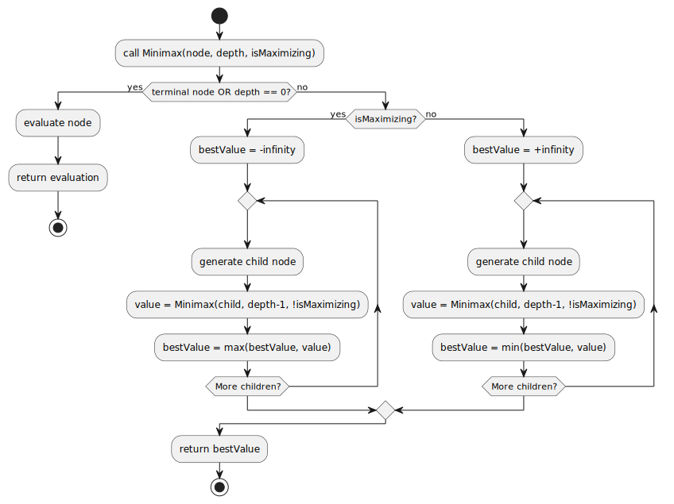
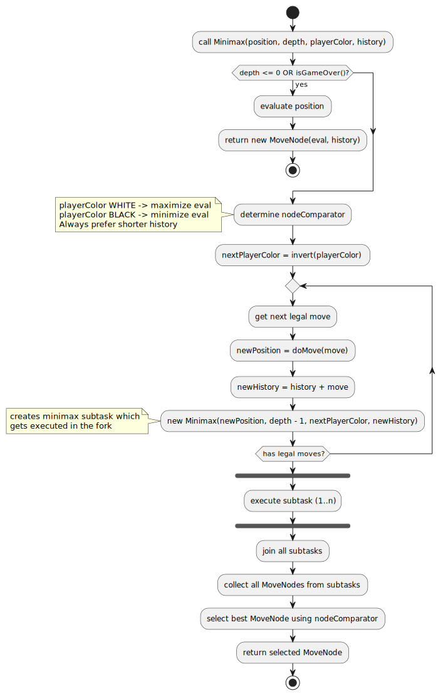

<div align="center">
  <div style="display: flex; align-items: center; justify-content: center;">
    
  </div>

  <h1>blobfish - A simple alternative to Stockfish.</h1>
</div>


# What is this?

**Blobfish** is a small Java chess engine with a CLI on top of it. 

# Packaging and running the application
This application requires Java 25 to run.

For Linux or macOS use:

```bash
./mvnw clean package
```

<details>
<summary>Permission issues?</summary>

Execute:

```bash
chmod a+x ./mvnw
```

</details>

or for Windows use:

```powershell
.\mvnw.cmd clean package
```

It produces the `blobfish-1.0.0-SNAPSHOT.jar` file in the `target/` directory.

The application is now runnable using

```bash
java -jar target/blobfish-1.0.0-SNAPSHOT.jar
```

# Chessboard display
The visualisation of the chessboard is optimized for monospace fonts, 
so the application should be run in a terminal with a monospace font (e.g. Cascadia Mono).
The font also needs to support Unicode symbols.


# Overview of the implementation

<div align="center" style="display: flex; align-items: center; justify-content: center;">
    
</div>

Generated class diagrams are stored in  `docs/generated-diagrams/`. A class diagram is available for each package.

## General MiniMax algorithm
This is a diagram for the minimax algorithm in general.
<div align="center" style="display: flex; align-items: center; justify-content: center;">
    
</div>

## Our sequential MiniMax algorithm implementation
This diagram depicts our sequential implementation of the minimax algorithm.
The algorithm additionally implements a history of moves for the following reasons:
1. If there are multiple moves with same outcome, use the shortest move order
2. Makes debugging much easier

<div align="center" style="display: flex; align-items: center; justify-content: center;">
    
</div>

## Our fork-join parallel MiniMax algorithm implementation
This diagram depicts our parallel implementation of the minimax algorithm using fork-join.
This implementation also uses a history for the same reasons as the sequential implementation.
<div align="center" style="display: flex; align-items: center; justify-content: center;">
    
</div>

# Performance tests
The summary of the performance tests can be found under [docs/performance/README.md](docs/performance/README.md)
