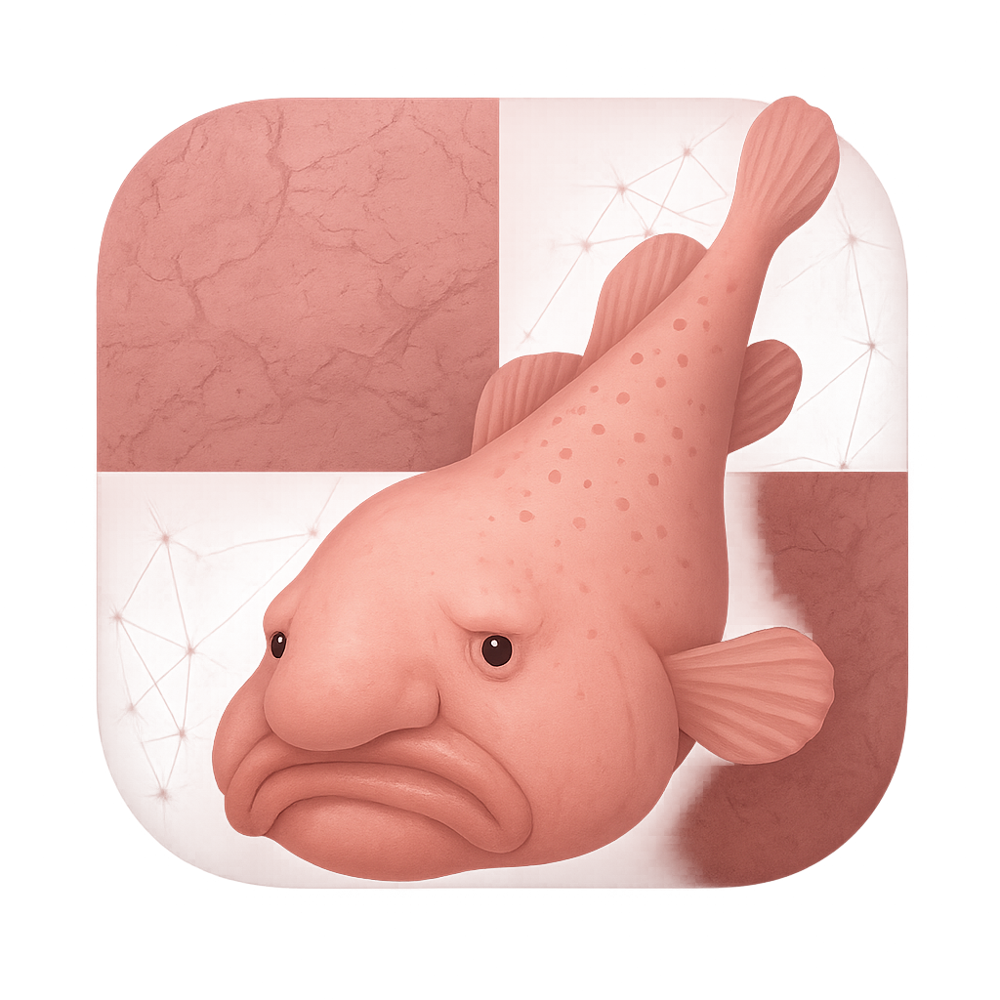
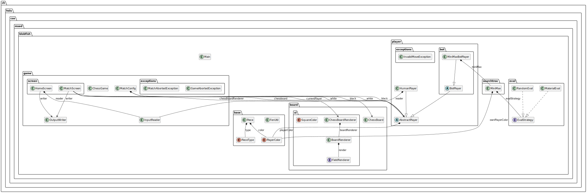

<div align="center">
  <div style="display: flex; align-items: center; justify-content: center;">
    
  </div>

  <h1>blobfish - A simple alternative to Stockfish.</h1>
</div>


## What is this?

**Blobfish** is a small Java chess engine with a CLI on top of it. 

## Packaging and running the application

For Linux or macOS use:

```bash
./mvnw clean package
```

or for Windows use:

```powershell
.\mvnw.cmd clean package
```

It produces the `blobfish-1.0.0-SNAPSHOT.jar` file in the `target/` directory.

The application is now runnable using

```bash
java -jar target/blobfish-1.0.0-SNAPSHOT.jar
```

## Overview of the implementation

<div align="center" style="display: flex; align-items: center; justify-content: center;">
    
</div>

Generated class diagrams are stored in  `docs/generated-diagrams/`. A class diagram is available for each package.
