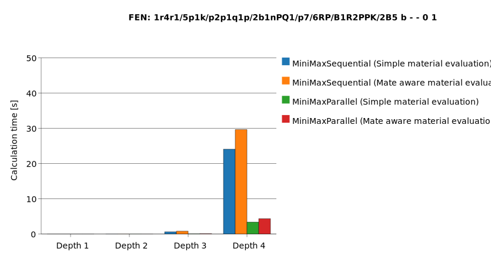
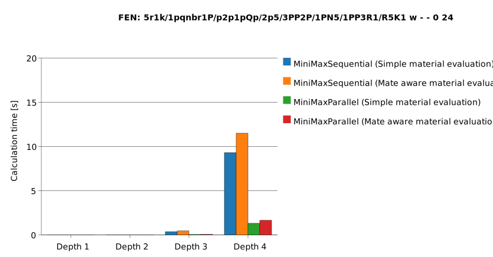
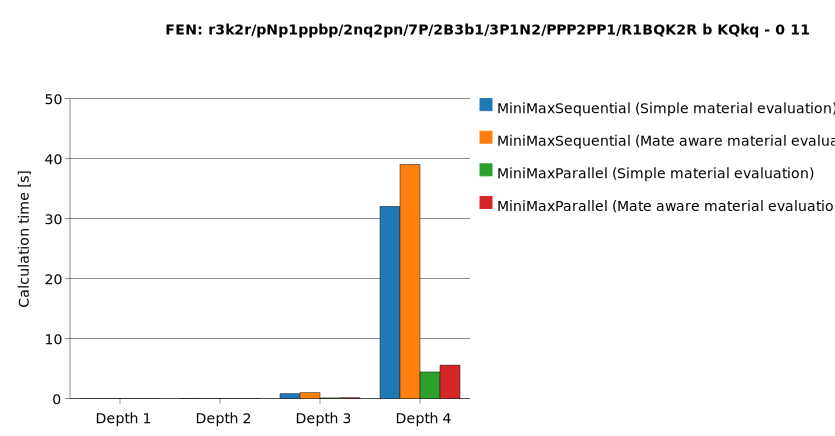
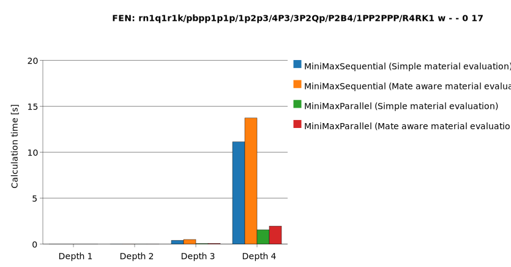
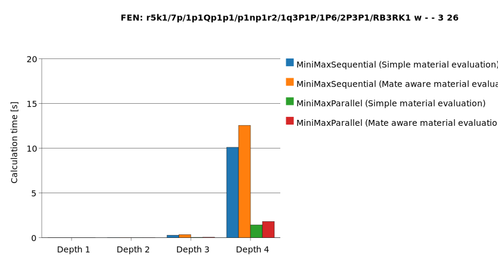
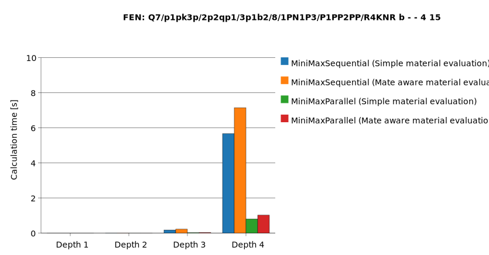
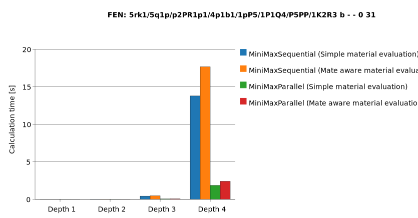
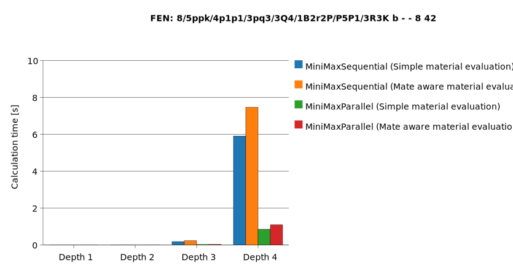
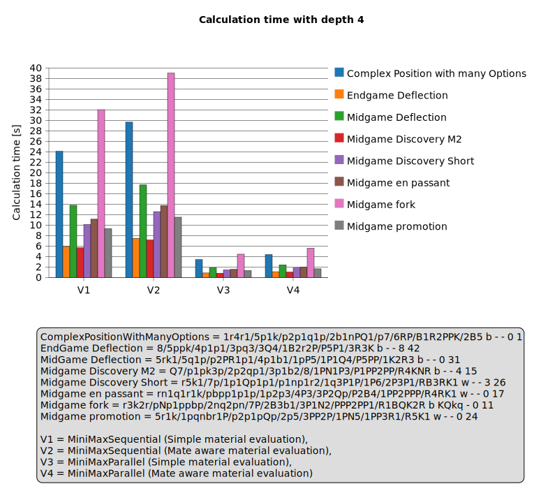

# Performance Test

## Which performance tests are executed

### [PerformanceTest.java](../../src/test/java/ch/hslu/cas/msed/blobfish/PerformanceTest.java)

This code is a JUnit test that compares the calculation time of different chess bot implementations. The variants differ
on the one hand by how the game tree is traversed (e.g.
[MiniMaxParallel.java](../../src/main/java/ch/hslu/cas/msed/blobfish/player/bot/minimax/MiniMaxParallel.java)), i.e. the
algorithm, and on the other hand by the board evaluation function (e.g.
[MateAwareEval.java](../../src/main/java/ch/hslu/cas/msed/blobfish/eval/MateAwareEval.java)).
The variants are assembled dynamically at test runtime.

For each combination of algorithm, evaluation function, and depth from 1 to 4, the next best move is computed multiple
times while measuring the execution time.
Out of 10 repetitions, the median is used as the runtime metric to reduce the impact of outliers.

All individual measurements and the aggregated medians are stored per position in files. In addition, a PlantUML bar
chart is generated and exported as SVG to visually evaluate performance.

These measurements, summaries, CSV, PlantUML, and SVG files are saved under `/measurements/[CURRENT_DATE_AND_TIME]`.

## Execute the Performance Test with your own PC

To run the performance tests, execute the following command from the repository root folder:

For Linux or macOS:

```bash
./mvnw test -Pperformance
```

or for Windows:

```powershell
.\mvnw.cmd test -Pperformance
```

## Measurements

### PC Setup

The following measurements were performed on this PC:

- Operating system: Microsoft Windows 11 Pro
- CPU: AMD Ryzen 7 7800X3D, 4.20 GHz, 8 cores / 16 threads
- Mainboard: MSI B650M GAMING PLUS WIFI
- RAM: 64GB DDR5
- GPU: RTX 4080 Super

### Results

The following tests were executed based on
commit [fa2eeeb](https://github.com/l2c0r3/blobfish/commit/fa2eeeb0ee42c84e25433a2660b09e4cf58db23b)
You can find the raw results here: [measurements/fa2eeeb](measurements/fa2eeeb)

|                                                                                                                                                                                                                               |                                                                                                                                                                                                                           |
|-------------------------------------------------------------------------------------------------------------------------------------------------------------------------------------------------------------------------------|---------------------------------------------------------------------------------------------------------------------------------------------------------------------------------------------------------------------------|
| **Complex Position With Many Options**<br/>FEN: `1r4r1/5p1k/p2p1q1p/2b1nPQ1/p7/6RP/B1R2PPK/2B5 b - - 0 1`<br/> | **MidGame Promotion Mate in 2**<br/>FEN: `5r1k/1pqnbr1P/p2p1pQp/2p5/3PP2P/1PN5/1PP3R1/R5K1 w - - 0 24`<br/> |
| **MidGame Fork**<br/>FEN: `r3k2r/pNp1ppbp/2nq2pn/7P/2B3b1/3P1N2/PPP2PP1/R1BQK2R b KQkq - 0 11`<br/>                                      | **MidGame EnPassant**<br/>FEN: `rn1q1r1k/pbpp1p1p/1p2p3/4P3/3P2Qp/P2B4/1PP2PPP/R4RK1 w - - 0 17`<br/>                        |
| **MidGame Discovery**<br/>FEN: `r5k1/7p/1p1Qp1p1/p1np1r2/1q3P1P/1P6/2P3P1/RB3RK1 w - - 3 26`<br/>                              | **MidGame Discovery Mate in 2**<br/>FEN: `Q7/p1pk3p/2p2qp1/3p1b2/8/1PN1P3/P1PP2PP/R4KNR b - - 4 15`<br/>    |
| **MidGame Deflection**<br/>FEN: `5rk1/5q1p/p2PR1p1/4p1b1/1pP5/1P1Q4/P5PP/1K2R3 b - - 0 31`<br/>                              | **EndGame Deflection**<br/>FEN: `8/5ppk/4p1p1/3pq3/3Q4/1B2r2P/P5P1/3R3K b - - 8 42`<br/>                                 |

As expected, at the first look we can see:

- The parallelization optimization reduces the calculation time
- The [Mate aware material evaluation](../../src/main/java/ch/hslu/cas/msed/blobfish/eval/MateAwareEval.java) has a negative impact on the calculation time

It gets more interesting when we focus on depth 4 and compare runtimes there:

<div style="min-width:320px">
<strong>Comparison of all positions at depth 4:</strong><br/>

</div>

If we want to estimate the average gain from parallelization, we can create the following table:

| Position                           | V1 / V3 | V2 / V4 | 
|------------------------------------|--------:|---------|
| Complex Position with many Options |    7.07 | 6.79    |
| Endgame Deflection                 |    6.91 | 6.82    |
| Midgame Deflection                 |    7.44 | 7.34    |
| Midgame Discovery M2               |    7.01 | 6.97    |
| Midgame Discovery Short            |    7.05 | 6.92    |
| Midgame en passant                 |    7.12 | 6.99    |
| Midgame fork                       |    7.21 | 6.98    |
| Midgame promotion                  |    7.08 | 6.95    |
| Average of the above results       |    7.11 | 6.97    |

This shows that, for our examples, parallelization makes the engine **~6.97** to **~7.11** times faster on average.

If we want to see the cost
of [Mate aware material evaluation](../../src/main/java/ch/hslu/cas/msed/blobfish/eval/MateAwareEval.java) we can build
the following table

| Position                           |  V3/V4 |
|------------------------------------|-------:|
| Complex Position with many Options |   0.78 |
| Endgame Deflection                 |   0.78 |
| Midgame Deflection                 |   0.77 |
| Midgame Discovery M2               |   0.79 |
| Midgame Discovery Short            |   0.79 |
| Midgame en passant                 |   0.80 |
| Midgame fork                       |   0.79 |
| Midgame promotion                  |   0.79 |
| Average of the above results       | 0.7863 |

From this we can derive that it requires on average `1 / 0.7863 ≈ 1.27`, i.e. ~27% more runtime.
Keeping it still makes sense, since it helps to deliver higher-quality moves.
