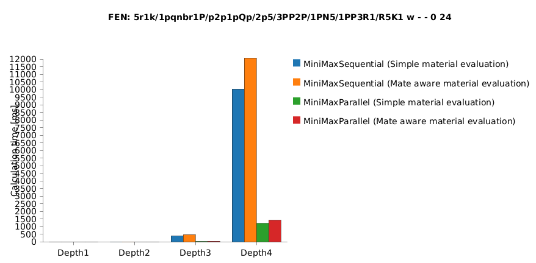
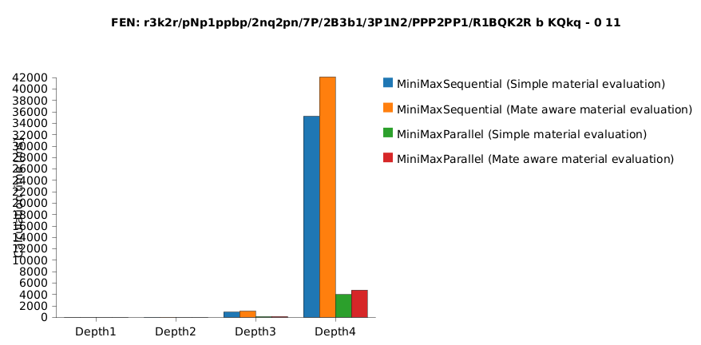
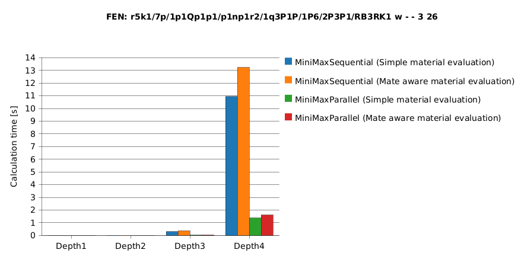
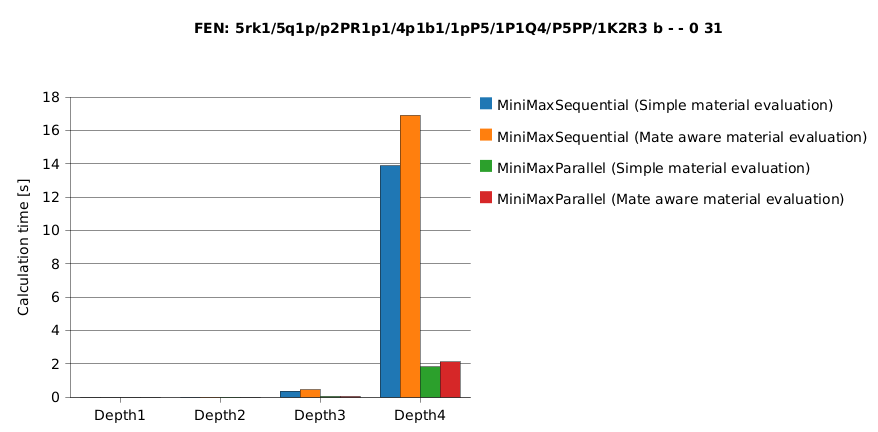
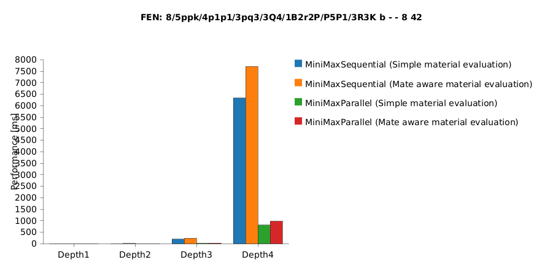
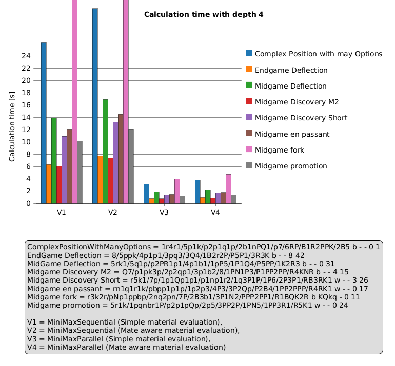

# Performance Test

## Welche Performance Tests werden ausgeführt

### [PerformanceTest.java](../../src/test/java/ch/hslu/cas/msed/blobfish/PerformanceTest.java)

Der Code ist ein JUnit Test, der die Berechnungszeit verschiedener Schachbot-Implementierungen vergleicht. Die Variation
der Schachbot-Implementierung unterscheidet sich einerseits durch die Art wie der Spielbaum durchgeganen wird (e.g
[MiniMaxParallel.java](../../src/main/java/ch/hslu/cas/msed/blobfish/player/bot/minimax/MiniMaxParallel.java)), was den
Algorithms darstellt und der Bewertungsfunktion des Schachbretts (
e.g [MateAwareEval.java](../../src/main/java/ch/hslu/cas/msed/blobfish/eval/MateAwareEval.java)).
Die Varianten werden zur Testzeit dynamisch zusammengestellt.

Pro Kombination aus Algorithmus, Bewertungsfunktion und Tiefe von 1 bis 4 wird der nächste beste Zug mehrfach berechnet
und dabei die Ausführungszeit gemessen.
Aus 10 Wiederholungen der Messung wird der Median als Kennzahl für die Laufzeit verwendet, um Ausreisser zu reduzieren.

Jeder einzelnen Messwerte und die zusammengefassten Mediane werden pro Stellung in Dateien gespeichert. Zusätzlich wird
ein PlantUML-Balkendiagramm erzeugt und als SVG exportiert, um die Performance visuell auszuwerten.

Diese Messwerte, Zusammenfassungen, CSV, PlantUML und SVG werden unter `/measurements/[AKTEULLES_DATUM_UND_ZEIT]`
gespeichert

## Execute the Performance Test with your own PC

Um die Performance Tests auszuführen, kann folgender Befehl vom root Folder ausgeführt werden:

For Linux or macOS:

```bash
./mvnw test -Pperformance
```

or for Windows:

```powershell
.\mvnw.cmd test -Pperformance
```

## Messungen

### PC Setup

Die nachfolgenden Messungen wurden mit folgendem PC durchgeführt:

- Betriebssystem: Microsoft Windows 11 Pro, Version 10.0.26200 (Build 26200)
- CPU: Intel Core i7-13700KF (13th Gen), 3.40 GHz, 16 Kerne / 24 Threads
- Mainboard: ASUS ROG STRIX Z790-F GAMING WIFI (ASUSTeK)
- RAM: 32GB
- GPU: AMD Radeon RX 9070

### Resultate

Die nachfolgenden Tests wurden mit dem Stand vom
Commit [71edae9](https://github.com/l2c0r3/blobfish/tree/71edae902790b45f286157de8d5b40bc6b19ee62)
durchgeführt. Die Rohdaten von den Ergebnissen findet ihr hier: [measurements/71edae9](measurements/71edae9)

|                                                                                                                                                                                                                               |                                                                                                                                                                                                                   |
|-------------------------------------------------------------------------------------------------------------------------------------------------------------------------------------------------------------------------------|-------------------------------------------------------------------------------------------------------------------------------------------------------------------------------------------------------------------|
| **Complex Position With Many Options**<br/>FEN: `1r4r1/5p1k/p2p1q1p/2b1nPQ1/p7/6RP/B1R2PPK/2B5 b - - 0 1`<br/> | **MidGame Promotion Mate in 2**<br/>FEN: `5r1k/1pqnbr1P/p2p1pQp/2p5/3PP2P/1PN5/1PP3R1/R5K1 w - - 0 24`<br/>     |
| **MidGame Fork**<br/>FEN: `r3k2r/pNp1ppbp/2nq2pn/7P/2B3b1/3P1N2/PPP2PP1/R1BQK2R b KQkq - 0 11`<br/>                                      | **MidGame EnPassant**<br/>FEN: `rn1q1r1k/pbpp1p1p/1p2p3/4P3/3P2Qp/P2B4/1PP2PPP/R4RK1 w - - 0 17`<br/>                    |
| **MidGame Discovery**<br/>FEN: `r5k1/7p/1p1Qp1p1/p1np1r2/1q3P1P/1P6/2P3P1/RB3RK1 w - - 3 26`<br/>                              | **MidGame Discovery Mate in 2**<br/>FEN: `Q7/p1pk3p/2p2qp1/3p1b2/8/1PN1P3/P1PP2PP/R4KNR b - - 4 15`<br/> |
| **MidGame Deflection**<br/>FEN: `5rk1/5q1p/p2PR1p1/4p1b1/1pP5/1P1Q4/P5PP/1K2R3 b - - 0 31`<br/>                                   | **EndGame Deflection**<br/>FEN: `8/5ppk/4p1p1/3pq3/3Q4/1B2r2P/P5P1/3R3K b - - 8 42`<br/>                              |

Wie zu erwarten sind auf dem ersten Blick folgendes zu erkennen:

- Die Optimierung mit Parallelisierung funktioniert
- Die
  `Mate aware material evaluation` ([MateAwareEval.java](../../src/main/java/ch/hslu/cas/msed/blobfish/eval/MateAwareEval.java))
  hat eine negative Auswirkung auf die Berechnungszeit

Spannend wird es nun, wenn wir den Fokus auf die Tiefe von 4 setzten und dort die Berechnungszeiten vergleichen:

<div style="min-width:320px">
<strong>Vergleich aller Positionen mit einer tiefe von vier:</strong><br/>

</div>

Wenn wir nun anschauen möchten, wass wir durchschnittlich mit der Parallelisierung gewinnen, können wir folgende Tabelle
aufstellen

| Position                           | V1 / V3 | V2 / V3 | 
|------------------------------------|--------:|---------|
| Complex Position with many Options |    8.20 | 8.37    |
| Endgame Deflection                 |    7.80 | 7.87    |
| Midgame Deflection                 |    7.60 | 7.97    |
| Midgame Discovery M2               |    7.60 | 8.23    |
| Midgame Discovery Short            |    7.73 | 8.21    |
| Midgame en passant                 |    8.16 | 8.45    |
| Midgame fork                       |    8.82 | 8.85    |
| Midgame promotion                  |    8.22 | 8.29    |
| Druchschnitt obrige Ergebnisse     |    8.01 | 8.29    |

Dadurch erkennen wir, dass bei unseren Beispiel im Durchschnitt Faktor **8.01** bis **8.29** mittels Parallelisierung
schneller sind.

Wenn wir nun sehen möchten, was und
das [MateAwareEval.java](../../src/main/java/ch/hslu/cas/msed/blobfish/eval/MateAwareEval.java)
kostet, können wir folgende Tabelle aufstellen:

| Position                           | V3/V4 |
|------------------------------------|------:|
| Complex Position with many Options |  0.84 |
| Endgame Deflection                 |  0.82 |
| Midgame Deflection                 |  0.86 |
| Midgame Discovery M2               |  0.87 |
| Midgame Discovery Short            |  0.85 |
| Midgame en passant                 |  0.86 |
| Midgame fork                       |  0.83 |
| Midgame promotion                  |  0.85 |
| Druchschnitt obrige Ergebnisse     |       |

**Ø V3/V4:** **0.8475**

Davon können wir ableitet, dass es Schnitt `1 / 0.8475 ≈ 1.18`, ~18% mehr Laufzeit benötigt.  
Dies zu behalten, mach jedoch Sinn, da wir hierbei qualitativ bessere Züge erhalten.
